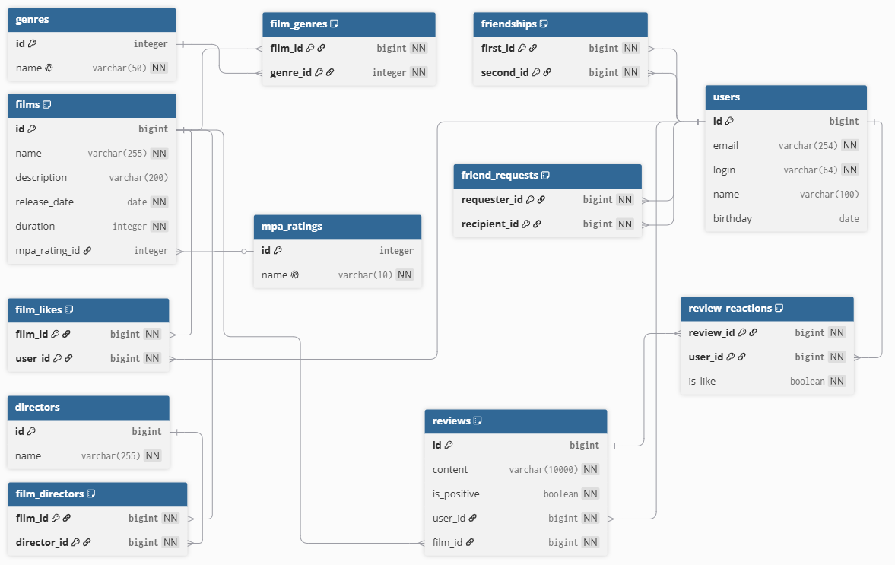

# java-filmorate

Filmorate — учебное приложение на Spring Boot для работы с фильмами, пользователями, лайками, жанрами,
возрастными рейтингами MPA и дружбой между пользователями.

На этом этапе приложение переведено с хранения данных в памяти на H2. В рабочем режиме данные сохраняются в файл,
поэтому фильмы, пользователи, лайки и связи не пропадают после перезапуска приложения. Для тестов используется
отдельная встроенная база в памяти.

## Что реализовано

- хранение пользователей и фильмов в H2 через DAO-классы на `JdbcTemplate`;
- создание схемы базы через `src/main/resources/schema.sql`;
- заполнение справочников жанров и рейтингов через `src/main/resources/data.sql`;
- получение жанров через `GET /genres` и `GET /genres/{id}`;
- получение рейтингов MPA через `GET /mpa` и `GET /mpa/{id}`;
- сохранение и получение MPA и жанров у фильмов;
- лайки фильмов и получение популярных фильмов;
- однонаправленное добавление в друзья для публичного API;
- расширенная внутренняя модель заявок и подтверждённой дружбы;
- интеграционные тесты DAO на `@JdbcTest` и `@AutoConfigureTestDatabase`;
- проверка стиля через Maven Checkstyle Plugin.

## Технологии

- Java 21
- Spring Boot 3.5.14
- Spring Web
- Spring JDBC
- H2 Database
- Lombok
- Jakarta Validation
- JUnit 5
- AssertJ
- Checkstyle
- Zalando Logbook

## Настройка базы данных

Рабочий datasource настроен в `src/main/resources/application.yaml`:

```yaml
spring:
  sql:
    init:
      mode: always

  datasource:
    url: jdbc:h2:file:./db/filmorate;AUTO_SERVER=TRUE
    driver-class-name: org.h2.Driver
    username: sa
    password: password
```

Файл базы создаётся в папке `db` в корне проекта. Эта папка добавлена в `.gitignore`, потому что в репозиторий должна
попадать схема и код приложения, а не локальные данные разработчика.

H2 Console включена по адресу:

```text
http://localhost:8080/h2-console
```

Параметры подключения:

```text
JDBC URL: jdbc:h2:file:./db/filmorate;AUTO_SERVER=TRUE
User Name: sa
Password: password
```

## Схема базы данных



Редактируемая версия схемы: https://dbdiagram.io/d/Filmorate-DB-6a3d31ded0074fe75d2305df

Основные таблицы:

- `users` — пользователи;
- `films` — фильмы;
- `genres` — справочник жанров;
- `mpa_ratings` — справочник рейтингов MPA;
- `film_genres` — связь фильмов и жанров;
- `film_likes` — лайки фильмов пользователями;
- `friend_requests` — однонаправленные заявки в друзья;
- `friendships` — подтверждённая дружба.

Справочник MPA использует американскую систему:

| id | name |
|----|------|
| 1  | G    |
| 2  | PG   |
| 3  | PG-13 |
| 4  | R    |
| 5  | NC-17 |

Справочник жанров соответствует коллекции Postman текущего задания:

| id | name |
|----|------|
| 1  | Комедия |
| 2  | Драма |
| 3  | Мультфильм |
| 4  | Триллер |
| 5  | Документальный |
| 6  | Боевик |

## Модель дружбы

В ТЗ сказано, что дружба должна быть однонаправленной: если пользователь добавляет другого пользователя в друзья,
то второй пользователь автоматически не получает первого в своём списке.

Публичное поведение API этому соответствует. После запроса:

```http
PUT /users/1/friends/2
```

пользователь `2` появляется в списке друзей пользователя `1`, но пользователь `1` не появляется в списке друзей
пользователя `2`.

Внутри приложения модель сделана немного подробнее, чем минимально требуется по ТЗ:

- `friend_requests` хранит направление заявки: кто кого добавил;
- `friendships` хранит подтверждённую дружбу, если второй пользователь тоже добавил первого;
- пара в `friendships` хранится в нормализованном виде: меньший id попадает в `first_id`, больший id — в `second_id`.

Такой вариант выбран осознанно. Он сохраняет совместимость с ожидаемым поведением Postman-коллекции, но при этом не
теряет важное состояние предметной области: можно отличить исходящую заявку, входящую заявку и подтверждённую дружбу.
Это ближе к реальному поведению социальных сервисов и оставляет место для развития функциональности.

Для публичного метода `GET /users/{id}/friends` исходящая заявка считается пользователем, которого автор добавил в
друзья. Подтверждённые дружбы тоже попадают в этот список. Входящие заявки в список не добавляются, поэтому внешний
контракт остаётся однонаправленным.

Дополнительно есть endpoint:

```http
GET /users/{id}/friends/{friendId}/status
```

Он возвращает подробное состояние связи между двумя пользователями.

## Основные endpoint'ы

### Пользователи

```http
POST   /users
PUT    /users
DELETE /users/{id}
GET    /users
GET    /users/{id}
PUT    /users/{id}/friends/{friendId}
DELETE /users/{id}/friends/{friendId}
GET    /users/{id}/friends
GET    /users/{id}/friends/common/{otherId}
GET    /users/{id}/friends/{friendId}/status
```

### Фильмы

```http
POST   /films
PUT    /films
DELETE /films/{id}
GET    /films
GET    /films/{id}
PUT    /films/{id}/like/{userId}
DELETE /films/{id}/like/{userId}
GET    /films/popular?count=10
```

### Жанры

```http
GET /genres
GET /genres/{id}
```

### Рейтинги MPA

```http
GET /mpa
GET /mpa/{id}
```

## Пример фильма

При создании и обновлении фильма жанры и рейтинг передаются объектами с идентификаторами:

```json
{
  "name": "The Matrix",
  "description": "Welcome to the real world",
  "releaseDate": "1999-03-31",
  "duration": 136,
  "mpa": {
    "id": 4
  },
  "genres": [
    {
      "id": 4
    },
    {
      "id": 6
    }
  ]
}
```

В ответе приложение возвращает фильм уже с заполненными названиями рейтинга и жанров.

## Запуск и проверка

Запустить приложение:

```bash
mvn spring-boot:run
```

Запустить тесты:

```bash
mvn test
```

Запустить Checkstyle:

```bash
mvn checkstyle:check
```

Перед отправкой на ревью приложение проверено через Postman-коллекцию `sprint.json`: все запросы проходят успешно.
